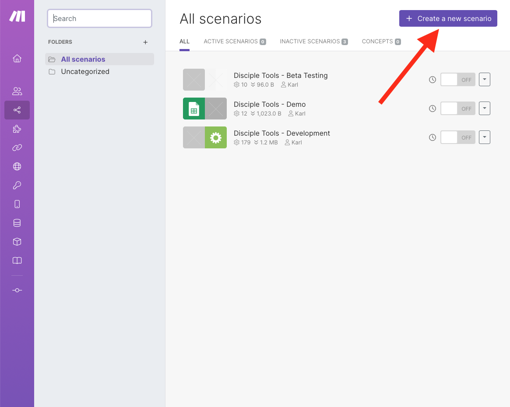
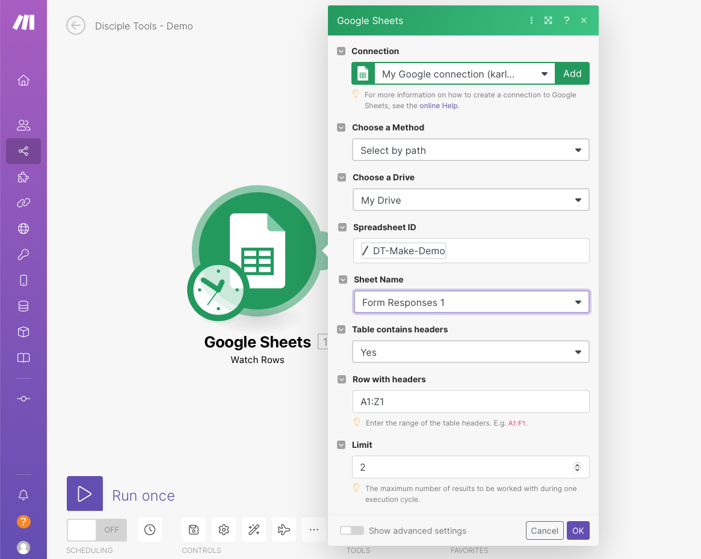
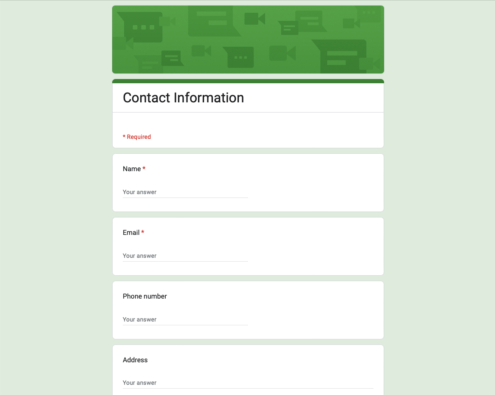
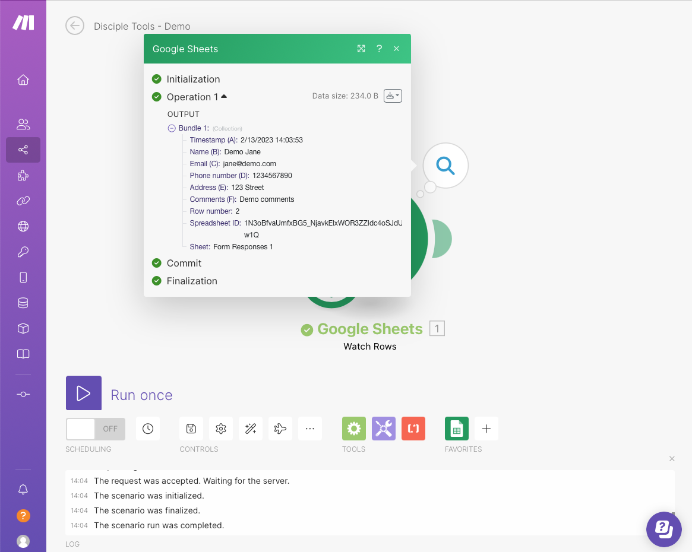
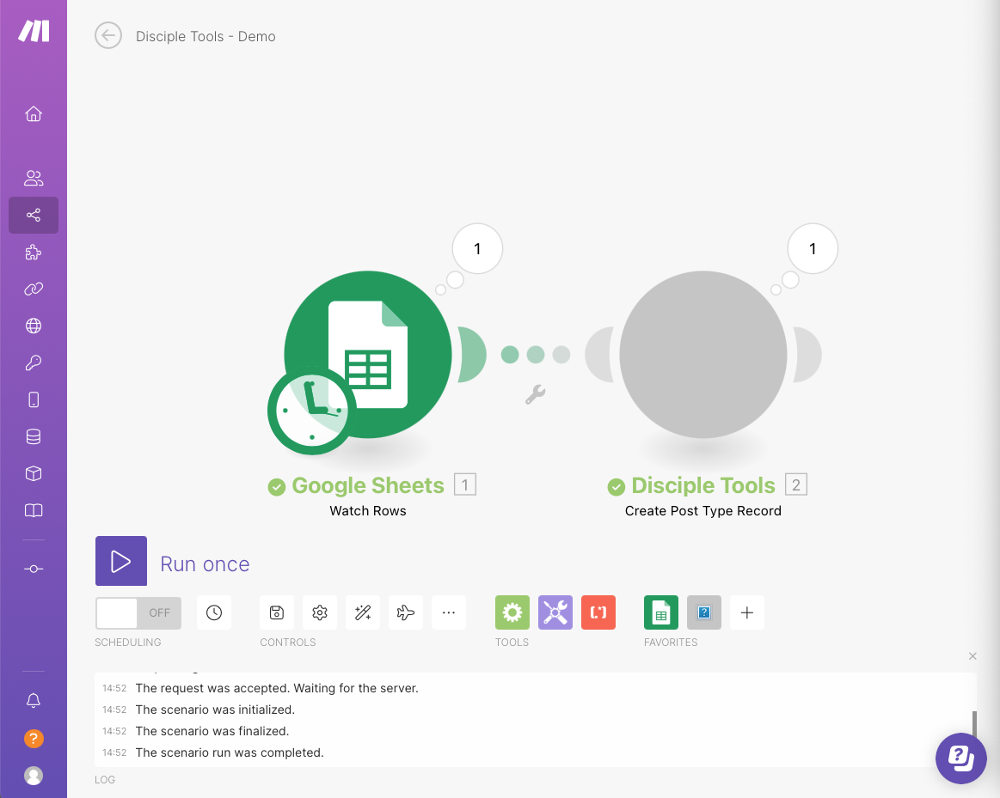
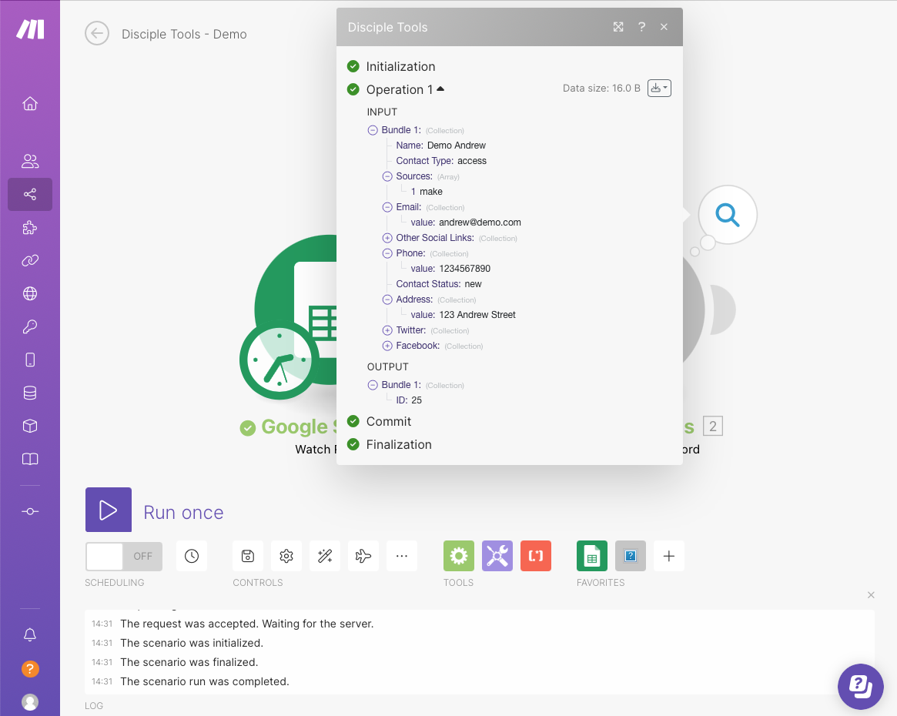
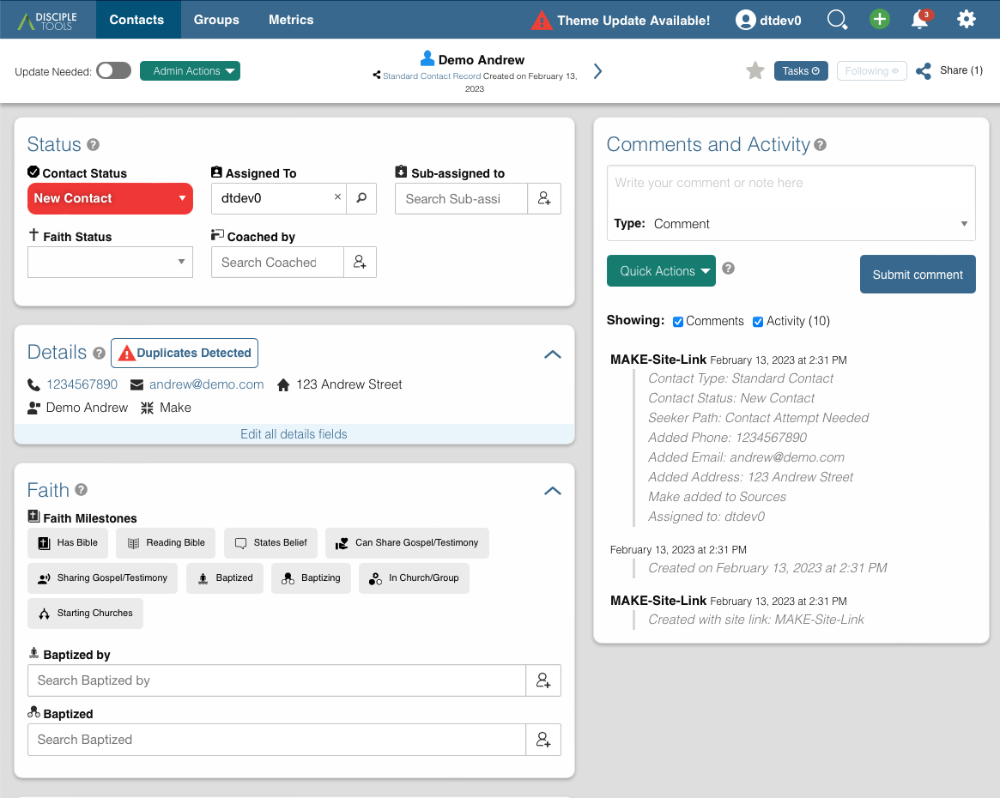

## Disciple Tools & Make.com Integration: First Scenario Workflow

> The aim of this guide is to walk you through the initial steps of setting up and executing your very first Disciple Tools, Make.com custom-app scenario workflow.

### Step 1: Make.com Registration
---

- Make your way over to [Make.com](https://www.make.com/) and if you have not already done so, register a new account.

### Step 2: Initial Login
---

- Once you have completed the registration process and login to Make.com for the first time, you will be presented with a `My Organization` dashboard.

- Before proceeding any further, it is recommended you spend some time reviewing [Make's Documentation](https://www.make.com/en/help/home), to familiarise yourself with it's common features.
- The [scenarios](https://www.make.com/en/help/scenarios) section is a prerequisite to better understand the following steps.

### Step 3: Create a D.T. Site Link
---

- A site-link token shall be required, in order to successfully establish a connection between Disciple Tools and Make.com.
- View [D.T. Site Links Documentation](https://disciple.tools/user-docs/getting-started-info/admin/site-links/) for detailed instructions on how to create site-links and source required transfer tokens.

- Ensure `Token As Transfer Key` is selected; whilst also making a note of generated `Token`; which will be required later.

### Step 4: First Make Scenario - Configuration
---

- Return back to the Make Dashboard and navigate to the scenarios section.

- Select the `Create a new scenario` option in the top-right corner, to enter into scenario editor mode.

- We shall create a very simple scenario workflow; which ingest Google Spreadsheet entries and using the information, creates a new DT record using the Disciple Tools `Create Post Type Record` module.

- In the top-left corner, name your scenario. For example: _Disciple Tools - Demo_

> Ensure to save changes as you go!

- Next, click the button in the center of the screen, to add our first app; which, in our case, will be `Google Sheets`.

> Wow! So many modules to choose from!

- Then, select the actual module we wish to deploy within our scenario. In our case, we are interested in modules of type `Trigger`; for example: _Watch Rows_

- You will then be prompted to establish a connection to the account storing target Google Sheet to be processed.

- Click add, to create a new connection.

> Google's `Client ID` and `Client Secret` can be found within their [Developer Console](https://console.developers.google.com/apis) and are __optional__.

> The actual steps taken to generate credentials, are beyond the scope of this document, but further information can be found in [Authenticate using API keys](https://cloud.google.com/docs/authentication/api-keys).

> Aternatively, if no client id or secret is specified, you will be automatically prompted to grant access to your target Google account.

- Once Google connection has been established, select spreadsheet to be processed.

- Once all settings have been specified, click ok and save scenario.

> Now is a good time as any, to test the configured module.

- Right-click on the module and select the `Run this module only` option.

- As our spreadsheet does not contain any values, we are not expecting to see any module outputs; but, we are expecting a successful run!

> Now, let's see some data!

- Navigate to the target Google Spreadsheet and enter some values.

> Notice the use of actual D.T. field value keys within `Age`, `Language` & `Milestones` columns; which is required when submitting record creation request.

> Typically, the Google Spreadsheet will be an intermediary staging area; used to store information captured from a web form; which would present field value labels; whilst storing actual value keys/ids.

- Re-run the module and view generated output; which should present spreadsheet row entries.

> Now, let's add D.T's creation module!

- Click on the `Watch Rows` side tab to add a new module.

- Search for the `Disciple Tools` app.

- Search for the `Create Post Type Record` module and add.

- Similar to the Google connection, create a new D.T connection to the target D.T instance.

- Whilst creating the connection, you will be prompted to enter values for the following fields:
    - DT Base URL:
        - This is the URL (including https:// protocol) to your D.T instance.
        > Please ensure to omit the terminating `/` at the end of the URL, as this is automatically assigned.
    - API Key:
        - This is the D.T site token; which was generated in step 3.
    - Post Type:
        - This is the target post type key; which will be used shoirtly, whilst mapping fields.

- Once connection fields have been populated, click save to be presented with a list of specified post type fields.

- At this junction, you will now map the presented D.T post type fields against the incoming fields from the connected module; Google Sheets, Watch Rows, in our case.

- On completion, you should have the following mappings.

- Click ok and save latest scenario updates.

> Now, let's put our scenario workflow to the test!

### Step 5: First Make Scenario - Workflow Run
---

- In order to test our workflow, simply click the `Run once` option in the bottom-left corner of the editor view.

> In the event of the workflow failing to run end-to-end, ensure to save scenario, navigate to the main dashboard and re-enter scenario; to ensure all changes have taken effect!

> Another gotcha to be aware of, is knowing the conditions your connected modules (Google Sheets - Watch Rows in our case), will trigger. As the workflow would stop if there is no data to be processed.

> Therefore, in our case, a new speadsheet row signals fresh data to be processed.

> On a successful run, all modules should be in a green state.

> In the event of errors, inspect the browser console for more detailed information.

- View module outputs to sanity check processed data.

### Step 6: D.T. Created Record Sanity Check
---

- As a final sanity check, navigate to your D.T. instance and confirm submitted record has indeed been created.

> Congratulations, as you now have a functioning [Make.com](https://www.make.com/) scenario workflow! :tada:

> From this point forward, you are now free to explore integrating the D.T. Create module with other apps more suitable to your use case.

Happy Making! :smile: